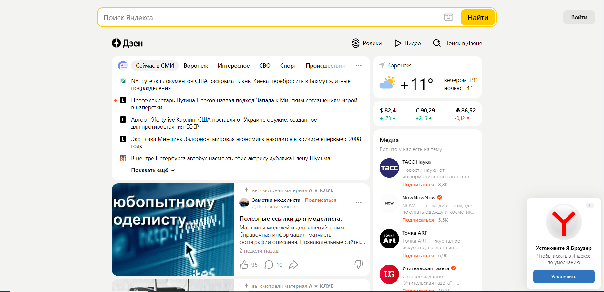
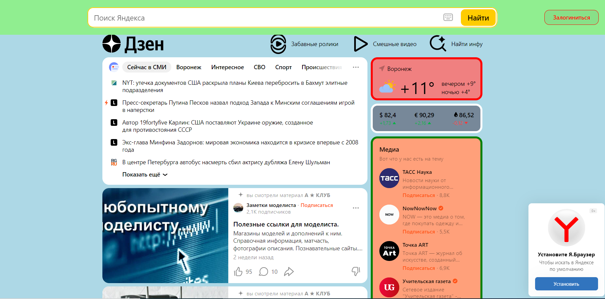
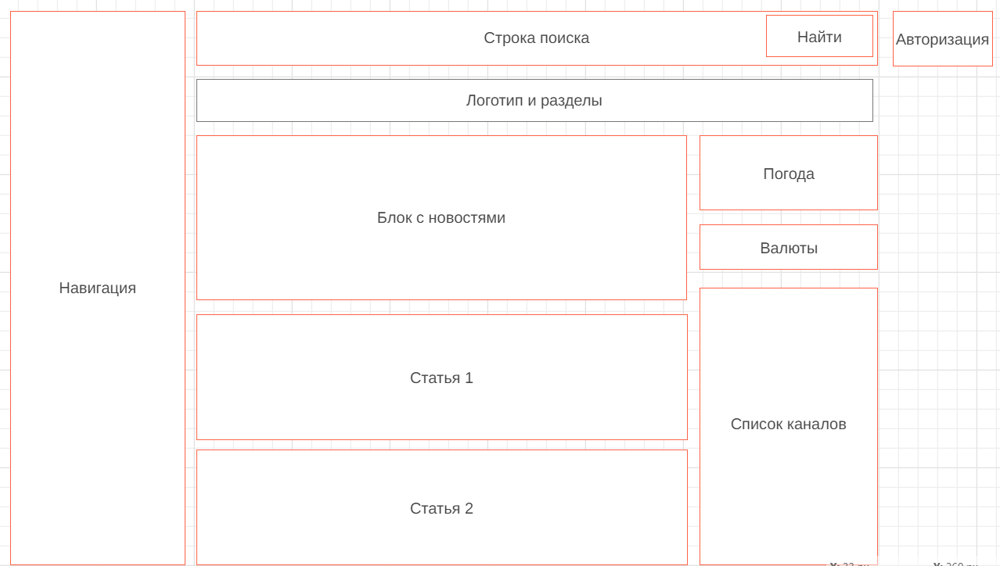

# Сайт работает на протоколе https
# Структура страницы состоит из:
Шапка сайта
```html
<header class="dzen-header-desktop__header-ST" data-testid="site-header">
```
Блок-контейнер с основной информацией:
```html
<main class="desktop-layout__main-2q">
```
1. Левый сайдбар с навигацией
```html
<section class="desktop-layout__leftColumn-25">
```
2. Основная информация
```html
<section class="desktop-layout__content-1S" aria-label="Контент">
```
3. Правый сайдбар с поиском
```html
<section class="desktop-layout__rightColumn-1G">
```
# Изменения с помощью Devtools:
Было:

Стало: 

# Структура сайта по блокам

